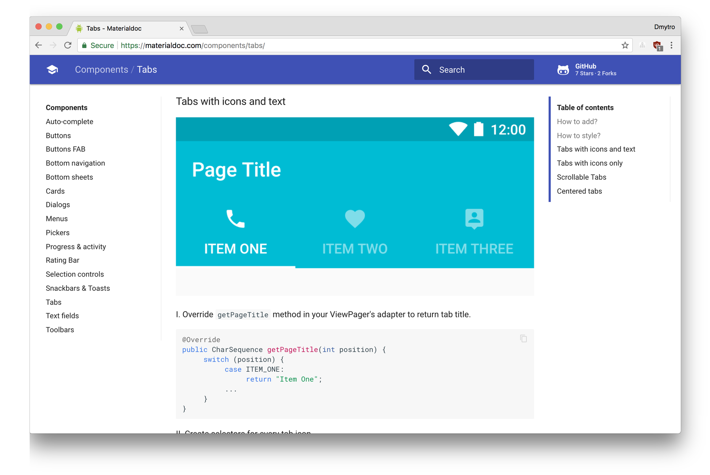

# Material Design - The development documentation

[https://materialdoc.com](https://materialdoc.com)

### What is this site about?

We feel there's a huge disconnect between [google material design guidelines](http://www.google.com/design/spec/material-design/introduction.html) and developers docs. After collecting feedback on [Google+](https://plus.google.com/+DmytroDanylyk/posts/MJYpZq666KA) and [Reddit](https://www.reddit.com/r/androiddev/comments/3qm8pk/do_you_think_material_design_spec_is_not_enough/) we decided to make a site with a single list of available material components and samples of their usage.

### What are you planning to cover?

We want to describe how to use and style material components with google appcompat and design libraries.

Later we will prepare tutorials of how to make widgets which are not available in google material spec/links to open source libraries.

### What is different between app compat and design library?

* `v7 appcompat library` - provide support of material design user interface implementations  for older Android platforms.

* `design library` - provides various material design components which are not part of Android SDK.

### Who are the authors?

* [Dmytro Danylyk](http://www.dmytrodanylyk.com/)
* [Yakiv Mospan](http://www.yakivmospan.com/)
* [Saúl Molinero](http://saulmm.github.io/)
* [Roman Danylyk](https://github.com/romandanylyk)
* Volodymyr Yatsykiv
* [Miguel Catalan Bañuls](https://geekytheory.com)
* [Luis G. Valle](http://lgvalle.xyz)
* Saúl Díaz González
* [Antonio Leiva](http://antonioleiva.com)
* [Alexandru Simonescu](http://alexsimo.com)
* [Paresh Mayani](http://www.technotalkative.com/)
* [Gonzalo Toledano](http://gnzlt.com)

### Want to help?

* Share this website to social media
* Star our repository [github.com/materialdoc](https://github.com/materialdoc/materialdoc-web)
* Write or edit article and send pull request to `master` branch. *(Make sure you have read [how to contribute](docs/how-to-contribute.md) section)*
