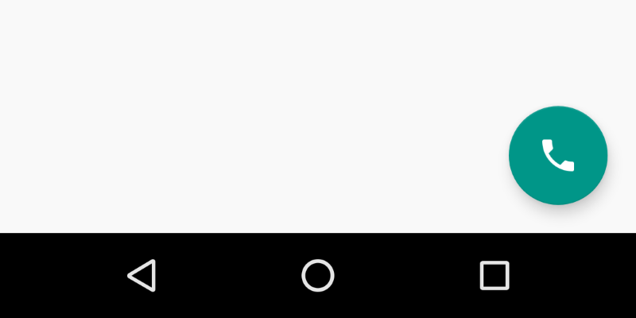

# Floating Action Button



?> From Google material design [documentation](https://material.io/guidelines/components/buttons-floating-action-button.html).
<br>
<br>A floating action button represents the primary action in an application. A floating action button is used for a promoted action.
<br>
<br>Shaped like a circled icon floating above the UI, it changes color upon focus and lifts upon selection. When pressed, it may contain more related actions.

### How to add?
I. In your `build.gradle`, add latest `appcompat` and `design` libraries.

```
dependencies {  
    compile 'com.android.support:appcompat-v7:X.X.X' // where X.X.X version
    compile 'com.android.support:design:X.X.X' // where X.X.X version
}
```

II. Make your activity extend `android.support.v7.app.AppCompatActivity`.

```java
public class MainActivity extends AppCompatActivity {  
    ...
}
```

III. Declare your `FloatingActionButton` inside any `layout.xml` file.

```xml
<android.support.design.widget.FloatingActionButton
    android:layout_width="wrap_content"
    android:layout_height="wrap_content"
    android:src="@drawable/ic_call" />
```

### How to style


#### Background color

I. Declare custom style in your values/styles.xml file.

```xml
<style name="MyFloatingButton" parent="Theme.AppCompat.Light">
    <item name="colorAccent">@color/pink</item>
</style>
```

II. Apply this style to your `FloatingActionButton` via `android:theme` attribute.

```xml
<android.support.design.widget.FloatingActionButton
    android:layout_width="wrap_content"
    android:layout_height="wrap_content"
    android:src="@drawable/ic_call"
    android:theme="@style/MyFloatingButton" />
```

### Ripple color

To change the color for the ripple effects when `FloatingActionButton` is pressed use `app:rippleColor` attribute.

```xml
<android.support.design.widget.FloatingActionButton
    android:layout_width="wrap_content"
    android:layout_height="wrap_content"
    android:src="@drawable/ic_call"
    app:rippleColor="@color/indigo" />
```

### Icon

To change `FloatingActionButton` icon use `android:src` attribute.

```xml
<android.support.design.widget.FloatingActionButton
    android:layout_width="wrap_content"
    android:layout_height="wrap_content"
    android:src="@drawable/ic_favorite"/>
```

### Size

Floating action buttons come in two sizes:
- Default size: For most use cases
- Mini size: Only used to create visual continuity with other screen elements

To change `FloatingActionButton` size use `app:fabSize` attribute with one of pre-defined constant values: `mini` or `normal`.

```xml
<android.support.design.widget.FloatingActionButton
    android:layout_width="wrap_content"
    android:layout_height="wrap_content"
    android:src="@drawable/ic_mini"
    app:fabSize="mini"/>
```
