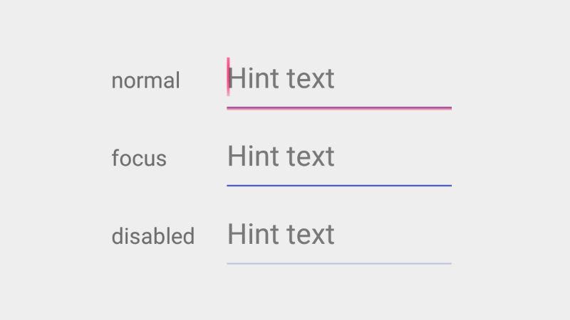
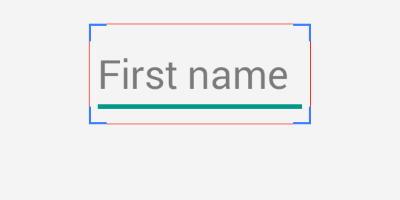

## Text Fields


?> From google material design [documentation](https://www.google.com/design/spec/components/text-fields.html).
<br>
<br>Text fields allow the user to input text, select text (cut, copy, paste), and lookup data via auto-completion.

### How to add?

I. In your `build.gradle` add latest `appcompat` library.

```
dependencies {
    compile 'com.android.support:appcompat-v7:X.X.X' // where X.X.X version
}
```
II. Make your activity extend `android.support.v7.app.AppCompatActivity`.

```
public class MainActivity extends AppCompatActivity {
    ...
}
```
III. Declare your `EditText` inside any `layout.xml` file.

```
<EditText
    android:layout_width="match_parent"
    android:layout_height="wrap_content"
    android:hint="Hint text"/>
```

### How to style?



I. Declare custom style in your `styles.xml` file.

```
<style name="MyEditText" parent="Theme.AppCompat.Light">
    <item name="colorControlNormal">@color/indigo</item>
    <item name="colorControlActivated">@color/pink</item>
</style>
```

II. Apply this style to your `EditText` via `android:theme` attribute.

```
<EditText
    android:layout_width="match_parent"
    android:layout_height="wrap_content"
    android:hint="Hint text"
    android:theme="@style/MyEditText"/>
```

### Compatibility issues

I. The height and vertical alignment of the `EditText` are different.

<div>
    <table>
        <tr>
            <td style="text-align:center; background-color: #FFFFFF;">
                Android 4.4
              </td>
            <td style="text-align:center; background-color: #FFFFFF;">
                Android 5.0
             </td>
            <td style="text-align:center; background-color: #FFFFFF;">
                Android 5.1
             </td>
        </tr>
        <tr>
        <td style="background-color: #FFFFFF;">
            
          </td>
        <td style="background-color: #FFFFFF;">
            
         </td>
        <td style="background-color: #FFFFFF;">
            
         </td>
        </tr>
    </table>
</div>

II. Line background is not transparent on Android 4.0 - 4.4 / 6.0 and is semi transparent on Android 5.0 / 5.1

## Single-line text field

?> From google material design [documentation](https://www.google.com/design/spec/components/text-fields.html#text-fields-single-line-text-field).
<br>
<br>Single-line fields automatically scroll their content to the left as the text input cursor reaches the right edge of the input field.

To make your `EditText` single line add `android:singleLine` attribute and set it's value to `true`.

```
<EditText
    android:layout_width="match_parent"
    android:layout_height="wrap_content"
    android:singleLine="true"
    android:hint="Hint text"/>
```

## Multi-line text field

?> From google material design [documentation](https://www.google.com/design/spec/components/text-fields.html#text-fields-multi-line-text-field).
<br>
<br>Multi-line text fields automatically break to a new line for overflow text and scroll vertically when the cursor reaches the lower edge.

To make your `EditText` multi-line add `android:inputType` attribute and set it's value to `textMultiLine`.

```
<EditText
    android:layout_width="match_parent"
    android:layout_height="wrap_content"
    android:inputType="textMultiLine"
    android:hint="Hint text"/>
```

## Full-width text field


?> From google material design [documentation](https://www.google.com/design/spec/components/text-fields.html#text-fields-full-width-text-field).
<br>
<br>Full-width text fields are useful for more in-depth tasks.

I. Declare custom style in your `styles.xml` file.

```
<style name="FullWidthEditText" parent="Widget.AppCompat.EditText">
    <item name="android:padding">20dp</item>
    <item name="android:background">@null</item>
    <item name="android:textSize">@dimen/abc_text_size_subhead_material</item>
</style>
```

II. Apply this style to your `EditText` via `style` attribute.

```
<EditText
    style="@style/FullWidthEditText"
    android:layout_width="match_parent"
    android:layout_height="wrap_content"
    android:hint="Subject"/>
```
