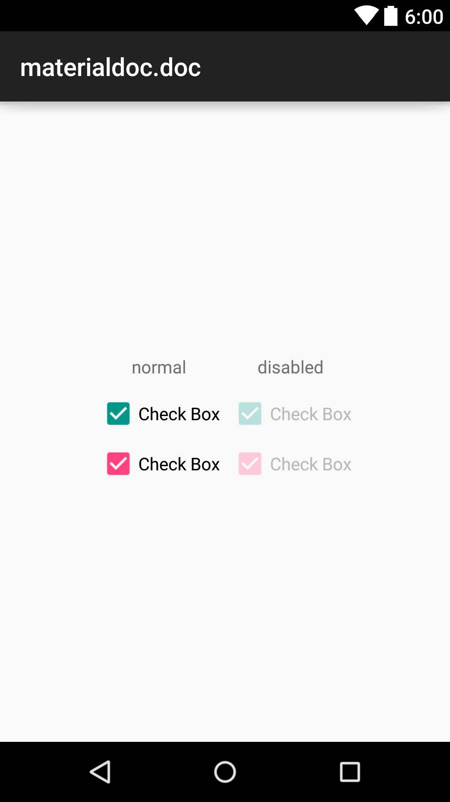

### Android Application

I am happy to announce that we just released open source [Android application](https://github.com/materialdoc/materialdoc) which includes all source code (layouts, styles, colors) of [materialdoc.com](http://www.materialdoc.com) tutorials.

You can [download apk](https://play.google.com/store/apps/details?id=com.materialdoc) and check how material components will look on different Android versions.

**Authors**

- Roman Danylyk
- Dmytro Danylyk

    <table>
        <tr>
            <td>
                
             </td>
            <td>
                
             </td>
        </tr>
    </table>

