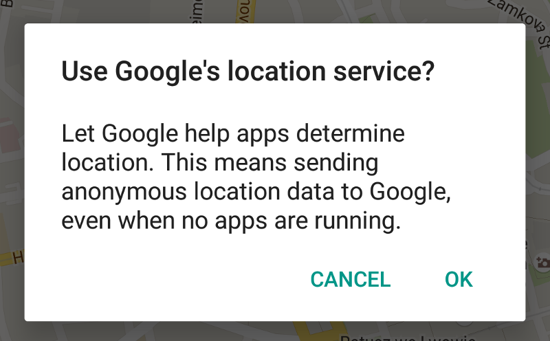
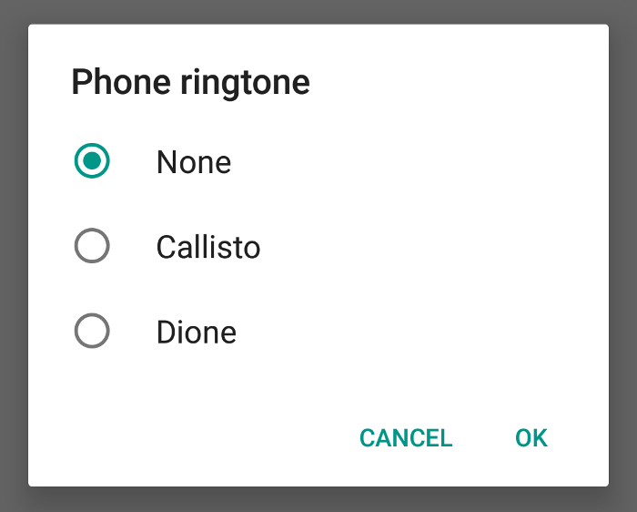
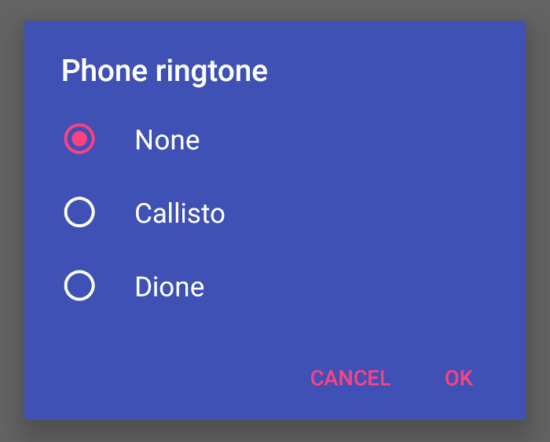

# Dialogs

## Alerts



!!! quote "From Google material design [documentation](https://material.io/guidelines/components/dialogs.html#dialogs-alerts)"
    Alerts are urgent interruptions, requiring acknowledgement, that inform the user about a situation.

### How to add?
I. In your `build.gradle` add latest `appcompat` library.

```
dependencies {  
    compile 'com.android.support:appcompat-v7:X.X.X' // where X.X.X version
}
```

II. Make your activity extend `android.support.v7.app.AppCompatActivity`.

```java
public class MainActivity extends AppCompatActivity {  
    ...
}
```

III. To create your dialog use  `android.support.v7.app.AlertDialog.Builder`.

```java
private void showLocationDialog() {
    AlertDialog.Builder builder = new AlertDialog.Builder(MainActivity.this);
    builder.setTitle(getString(R.string.dialog_title));
    builder.setMessage(getString(R.string.dialog_message));

    String positiveText = getString(android.R.string.ok);
    builder.setPositiveButton(positiveText,
            new DialogInterface.OnClickListener() {
        @Override
        public void onClick(DialogInterface dialog, int which) {
            // positive button logic
        }
    });

    String negativeText = getString(android.R.string.cancel);
    builder.setNegativeButton(negativeText,
            new DialogInterface.OnClickListener() {
        @Override
        public void onClick(DialogInterface dialog, int which) {
            // negative button logic
        }
    });

    AlertDialog dialog = builder.create();
    // display dialog
    dialog.show();
}
```

### How to style?


I. Declare custom `drawable.xml` for dialog background.

```xml
<?xml version="1.0" encoding="utf-8"?>
<!-- From: support/v7/appcompat/res/drawable/abc_dialog_material_background_light.xml -->
<inset xmlns:android="http://schemas.android.com/apk/res/android"
    android:insetLeft="16dp"
    android:insetTop="16dp"
    android:insetRight="16dp"
    android:insetBottom="16dp">

    <shape android:shape="rectangle">
        <corners android:radius="2dp" />
        <solid android:color="@color/indigo" />
    </shape>

</inset>
```

II. Declare custom styles in your `styles.xml` file.

```xml
<style name="MyDialogTheme" parent="Theme.AppCompat.Light.Dialog.Alert">
    <!--buttons color-->
    <item name="colorAccent">@color/pink</item>
    <!--title and message color-->
    <item name="android:textColorPrimary">@android:color/white</item>
    <!--dialog background-->
    <item name="android:windowBackground">@drawable/background_dialog</item>
</style>
```

III. Create your dialog and use `style` as parameter in `AlertDialog.Builder`.

```java
AlertDialog.Builder builder = 
        new AlertDialog.Builder(this, R.style.MyDialogTheme);
...
AlertDialog dialog = builder.create();
// display dialog
dialog.show();
```

!!! note 
        You can also style dialog in your activity theme via `alertDialogTheme` attribute.

## Confirmation Dialogs



!!! quote "From Google material design [documentation](https://material.io/guidelines/components/dialogs.html#dialogs-confirmation-dialogs)"
    Confirmation dialogs require users to explicitly confirm their choice before an option is committed. For example, users can listen to multiple ringtones but only make a final selection upon touching “OK.”
    Tapping “Cancel” in a confirmation dialog, or pressing “Back,” cancels the action, discards any changes, and closes the dialog.

## How to add?

I. In your `build.gradle` add latest `appcompat` library.

```
dependencies {  
    compile 'com.android.support:appcompat-v7:X.X.X' // where X.X.X version
}
```

II. Make your activity extend `android.support.v7.app.AppCompatActivity`.

```java
public class MainActivity extends AppCompatActivity {  
    ...
}
```

III. To create dialog use  `android.support.v7.app.AlertDialog.Builder`.

#### Single choice dialog
To create dialog with single choice list use method `setSingleChoiceItems` in your `builder` object.

```java
public void showDialog() {
    AlertDialog.Builder builder = new AlertDialog.Builder(MainActivity.this);
    builder.setTitle(R.string.dialog_title);

    //list of items
    String[] items = getResources().getStringArray(R.array.ringtone_list);
    builder.setSingleChoiceItems(items, 0,
            new DialogInterface.OnClickListener() {
        @Override
        public void onClick(DialogInterface dialog, int which) {
            // item selected logic
        }
    });

    String positiveText = getString(android.R.string.ok);
    builder.setPositiveButton(positiveText,
            new DialogInterface.OnClickListener() {
        @Override
        public void onClick(DialogInterface dialog, int which) {
            // positive button logic
        }
    });

    String negativeText = getString(android.R.string.cancel);
    builder.setNegativeButton(negativeText, 
            new DialogInterface.OnClickListener() {
        @Override
        public void onClick(DialogInterface dialog, int which) {
            // negative button logic
        }
    });

    AlertDialog dialog = builder.create();
    // display dialog
    dialog.show();
}
```

#### Multiple choice dialog
To create dialog with multiple choice list use method `setMultiChoiceItems` in your `builder` object.

```java
...
builder.setMultiChoiceItems(items, selectedItemsArray,
        new DialogInterface.OnMultiChoiceClickListener() {
    @Override
    public void onClick(DialogInterface dialog, int which, boolean isChecked) {
        //item checked logic
    }
});
...
```

## How to style



I. Declare custom `drawable.xml` for dialog background.

```xml
<?xml version="1.0" encoding="utf-8"?>
<!-- From: support/v7/appcompat/res/drawable/abc_dialog_material_background_light.xml -->
<inset xmlns:android="http://schemas.android.com/apk/res/android"
    android:insetLeft="16dp"
    android:insetTop="16dp"
    android:insetRight="16dp"
    android:insetBottom="16dp">

    <shape android:shape="rectangle">
        <corners android:radius="2dp" />
        <solid android:color="@color/indigo" />
    </shape>

</inset>
```

II. Declare custom styles in your `styles.xml` file.

```java
<style name="MyDialogTheme" parent="Theme.AppCompat.Light.Dialog.Alert">
    <!--item RadioButton or CheckBox color-->
    <item name="colorControlNormal">@android:color/white</item>
    <item name="colorControlActivated">@color/pink</item>
    <!--item text color-->
    <item name="textColorAlertDialogListItem">@android:color/white</item>
    <!--buttons color-->
    <item name="colorAccent">@color/pink</item>
    <!--title and message color-->
    <item name="android:textColorPrimary">@android:color/white</item>
    <!--dialog background-->
    <item name="android:windowBackground">@drawable/background_dialog</item>
</style>
```

III. Create your dialog and use style as parameter in `AlertDialog.Builder`.

```java
AlertDialog.Builder builder = 
        new AlertDialog.Builder(this, R.style.MyDialogTheme);
...
AlertDialog dialog = builder.create();  
// display dialog
dialog.show();
```


