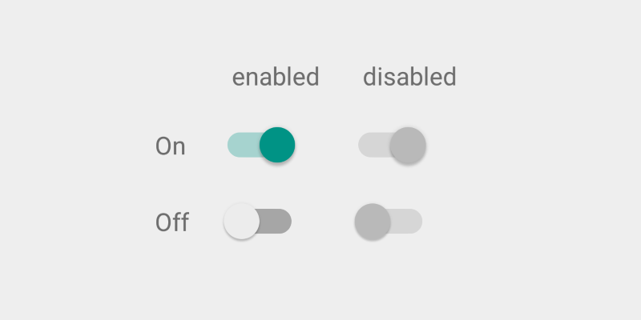

# Selection Controls

## Check Box


!!! quote "From google material design [documentation](https://material.io/guidelines/components/selection-controls.html#selection-controls-checkbox)."
    Checkboxes allow the user to select multiple options from a set.

    If you have multiple options appearing in a list, you can preserve space by using checkboxes instead of on/off switches.

    If you have a single option, avoid using a checkbox and use an on/off switch instead.

### How to add?

I. In your `build.gradle` add latest `appcompat` library.

```
dependencies {
    compile 'com.android.support:appcompat-v7:X.X.X' // where X.X.X version
}
```
II. Make your activity extend `android.support.v7.app.AppCompatActivity`.

```java
public class MainActivity extends AppCompatActivity {
    ...
}
```
III. Declare your `CheckBox` inside any `layout.xml` file

```xml
<CheckBox
    android:layout_width="wrap_content"
    android:layout_height="wrap_content"
    android:checked="true"
    android:text="Check Box"/>
```

### How to style?


I. Declare custom style in your `styles.xml` file.

```xml
<style name="MyCheckBox" parent="Theme.AppCompat.Light">
    <item name="colorControlNormal">@color/indigo</item>
    <item name="colorControlActivated">@color/pink</item>
</style>
```

II. Apply this style to your `CheckBox` via `android:theme` attribute.

```xml
<CheckBox
    android:layout_width="wrap_content"
    android:layout_height="wrap_content"
    android:checked="true"
    android:text="Check Box"
    android:theme="@style/MyCheckBox"/>
```

## Radio Button


!!! note "From google material design [documentation](https://material.io/guidelines/components/selection-controls.html#selection-controls-radio-button)."
    Radio buttons allow the user to select one option from a set. Use radio buttons for exclusive selection if you think that the user needs to see all available options side-by-side.

    Otherwise, consider a dropdown, which uses less space than displaying all options.

### How to add?

I. In your `build.gradle` add latest `appcompat` library.

```
dependencies {
    compile 'com.android.support:appcompat-v7:X.X.X' // where X.X.X version
}
```
II. Make your activity extend `android.support.v7.app.AppCompatActivity`.

```java
public class MainActivity extends AppCompatActivity {
    ...
}
```
III. Declare your `RadioButton` inside any `layout.xml` file

```xml
<RadioButton
    android:layout_width="wrap_content"
    android:layout_height="wrap_content"
    android:checked="true"
    android:text="Radio Button"/>
```

### How to style?


I. Declare custom style in your `styles.xml` file.

```xml
<style name="MyRadioButton" parent="Theme.AppCompat.Light">
    <item name="colorControlNormal">@color/indigo</item>
    <item name="colorControlActivated">@color/pink</item>
</style>
```

II. Apply this style to your `RadioButton` via `android:theme` attribute.

```xml
<RadioButton
    android:layout_width="wrap_content"
    android:layout_height="wrap_content"
    android:checked="true"
    android:text="Radio Button"
    android:theme="@style/MyRadioButton"/>
```

## Switch



!!! note "From google material design [documentation](https://material.io/guidelines/components/selection-controls.html#selection-controls-switch)."
    On/off switches toggle the state of a single settings option. The option that the switch controls, as well as the state it’s in, should be made clear from the corresponding inline label. Switches take on the same visual properties of the radio button.

    The on/off slide toggle with the text “on” and “off” included within the asset is deprecated. Use the switch shown here instead.

### How to add?

I. In your `build.gradle` add latest `appcompat` library.

```
dependencies {
    compile 'com.android.support:appcompat-v7:X.X.X' // where X.X.X version
}
```
II. Make your activity extend `android.support.v7.app.AppCompatActivity`.

```java
public class MainActivity extends AppCompatActivity {
    ...
}
```
III. Declare your `SwitchCompat` inside any `layout.xml` file

```xml
<android.support.v7.widget.SwitchCompat
    android:layout_width="wrap_content"
    android:layout_height="wrap_content"
    android:checked="true"/>
```

!!! note
    `android.support.v7.widget.SwitchCompat` is a backward compatible version of the Switch widget.

### How to style?


I. Declare custom style in your `styles.xml` file.

```xml
<style name="MySwitch" parent="Theme.AppCompat.Light">
    <!-- active thumb & track color (30% transparency) -->
    <item name="colorControlActivated">@color/indigo</item>

    <!-- inactive thumb color -->
    <item name="colorSwitchThumbNormal">@color/pink</item>

    <!-- inactive track color (30% transparency) -->
    <item name="android:colorForeground">@color/grey</item>
</style>
```

II. Apply this style to your `SwitchCompat` via `android:theme` attribute.

```xml
<android.support.v7.widget.SwitchCompat
    android:layout_width="wrap_content"
    android:layout_height="wrap_content"
    android:checked="true"
    android:theme="@style/MySwitch"/>
```

!!! note
    Android automatically add 30% transparency to `colorControlActivated` and `android:colorForeground` for `SwitchCompat`.
