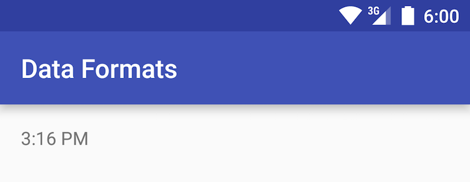
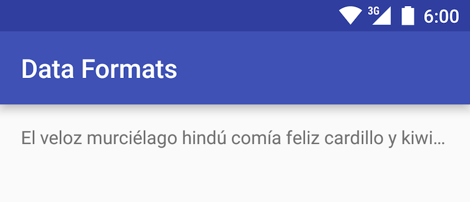

# Data formats

## Date & time



!!! quote "[From the Google material design documentation](https://material.io/guidelines/patterns/data-formats.html#)"
    How you format the date and time depends on a few factors:

    * If the time or date is the current one
    * Whether you are using the 12-hour or 24-hour clock
    * How specific you need to be

I. Declare a `TextView` in your layout file.

```xml
<TextView
    android:id="@+id/hora"
    android:layout_width="wrap_content"
    android:layout_height="wrap_content"
    />
```

II. In your Activity, get the time format which corresponds the locale and configuration of the device.

```java
// import android.text.format.DateFormat
DateFormat timeFormat = DateFormat.getTimeFormat(context);
```

III. Get the text with the current time and insert it in the  `TextView`

```java
TextView hourTextView = (TextView) findViewById(R.id.hourTextView);
horaTextView.setText(timeFormat.format(new Date()));
```


I. Declare a `TextView` in your layout file.

```xml
<TextView
    android:id="@+id/fecha"
    android:layout_width="wrap_content"
    android:layout_height="wrap_content"
    />
```
II. In your `Activity`, get the format of the date which corresponds to the locale and configuration of the devices. Depending on the available space you can use medium, long or numeric format.

```java
DateFormat numericDateFormat =
    DateFormat.getDateFormat(context);

DateFormat mediumDateFormat =
    DateFormat.getMediumDateFormat(context);

DateFormat longDateFormat =
    DateFormat.getLongDateFormat(context);
```

III. Get the text with the actual date and put it in your  `TextView`

```java
TextView fechaTextView = (TextView) findViewById(R.id.dateTextView);
fechaTextView.setText(longDateFormat.format(new Date()));
```

!!! note
    The `DateFormat` class allows many configurations according to your specific needs, for more information see the [development guides](http://developer.android.com/intl/es/reference/java/text/DateFormat.html).

## Data redaction and truncation

### Redacting numbers


!!! note "From Google material design [documentation](https://material.io/guidelines/patterns/data-formats.html#data-formats-data-redaction-truncation)".
    Midline ellipses [• • •] are three-bullet glyphs used to represent numeric truncation and the redaction of sensitive data, such as credit card, debit card, and Social Security numbers.

I. Declare a `TextView` in the layout of your `Activity`.

```xml
<TextView
   android:id="@+id/numero_tarjeta"
   android:layout_width="wrap_content"
   android:layout_height="wrap_content"
   />
```

II. Get the characters corresponding to the points and short spaces.

```java
String space = "\u0020";
String thinSpace = "\u2006";
String bullet = "\u2022";
```

III. Build the final text pattern separating the points with short spaces. Between the text and ellipsis must have two normal spaces, and between the ellipsis and the remaining numbers must be just one short space.

```java
String creditCardFinalDigits = "1234";
String finalText = "Visa" + space + space + bullet + thinSpace + bullet + thinSpace + bullet + thinSpace + creditCardFinalDigits;
```

IV. Add your text to the `TextView`.

```java
TextView cardTextView = (TextView) findViewById(R.id.creditcard_textview);
cardTextView.setText(finalText);
```

### Redacting letters



!!! note "From Google material design [documentation](https://material.io/guidelines/patterns/data-formats.html#data-formats-data-redaction-truncation)."
    Baseline ellipses [...] represent letters, words or phrases that aren’t shown. They also represent text truncation of a name or email address.

To automatically place ellipses depending on the space available:

I. Declare a `TextView` in the layout of your `Activity` with the attributes `lines="1"` and `ellipsize="end"`.

```xml
<TextView
    android:id="@+id/titleTextView"
    android:layout_width="wrap_content"
    android:layout_height="wrap_content"
    android:lines="1"
    android:ellipsize="end"
    />
```

II. Add a large text to the `TextView`.

```java
TextView titleTextView = (TextView) findViewById(R.id.titleTextView);
titleTextView.setText(R.string.bat);
```
