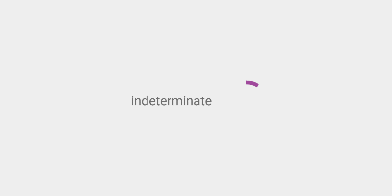
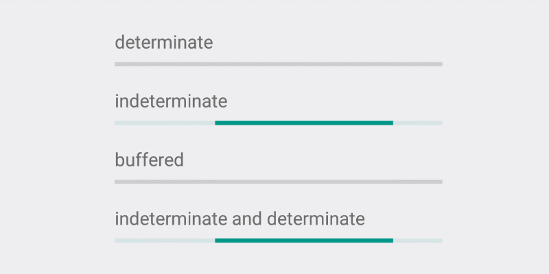
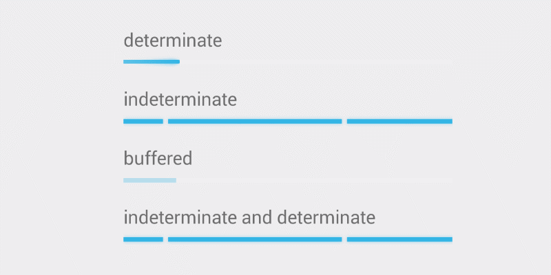

# Progress

## Circular


?> From google material design [documentation](http://www.google.com/design/spec/components/progress-activity.html#).
Minimize visual changes that occur while your app loads content by representing each operation with a single activity indicator. For example, a refresh operation should display either a refresh bar or an activity circle, but not both.

### How to add?

I. In your `build.gradle` add latest `appcompat` library.

```
dependencies {
    compile 'com.android.support:appcompat-v7:X.X.X' // where X.X.X version
}
```

II. Make your activity extend. `android.support.v7.app.AppCompatActivity`.

```java
public class MainActivity extends AppCompatActivity {
    ...
}
```

III. Declare your `ProgressBar` inside any `layout.xml` file.

```
<ProgressBar
    style="@style/Widget.AppCompat.ProgressBar"
    android:layout_width="wrap_content"
    android:layout_height="wrap_content"/>
```

### How to style?



I. Declare custom style in your `styles.xml` file.

```
<style name="CircularProgress" parent="Theme.AppCompat.Light">
    <item name="colorAccent">@color/indigo</item>
</style>
```

II. Apply this style to your `ProgressBar` via `android:theme` attribute.

```
<ProgressBar
    android:theme="@style/CircularProgress"
    style="@style/Widget.AppCompat.ProgressBar"
    android:layout_width="wrap_content"
    android:layout_height="wrap_content"/>
```

### Compatibility issues

!>`ProgressBar` is not displayed in material style on pre Lollipop devices.


## Linear



?> From google material design [documentation](http://www.google.com/design/spec/components/progress-activity.html#).
A linear progress indicator should always fill from 0% to 100% and never decrease in value. It should be represented by bars on the edge of a header or sheet that appear and disappear.

### How to add?

I. In your `build.gradle` add latest `appcompat` library.

```
dependencies {
    compile 'com.android.support:appcompat-v7:X.X.X' // where X.X.X version
}
```

II. Make your activity extend`android.support.v7.app.AppCompatActivity`.

```java
public class MainActivity extends AppCompatActivity {
    ...
}
```

III. Declare your `ProgressBar` inside any `layout.xml` file.

```
<ProgressBar
    style="@style/Widget.AppCompat.ProgressBar.Horizontal"
    android:layout_width="wrap_content"
    android:layout_height="wrap_content"/>
```

#### Indeterminate

To create indeterminate `ProgressBar` set `android:indeterminate` attribute to `true`.

```
<ProgressBar
    style="@style/Widget.AppCompat.ProgressBar.Horizontal"
    android:layout_width="wrap_content"
    android:layout_height="wrap_content"
    android:indeterminate="true"/>
```

#### Determinate

I. To create determinate `ProgressBar` set `android:indeterminate` attribute to `false`.

```
<ProgressBar
    android:id="@+id/progressBar"
    style="@style/Widget.AppCompat.ProgressBar.Horizontal"
    android:layout_width="wrap_content"
    android:layout_height="wrap_content"
    android:indeterminate="false"
    android:max="100"
    android:progress="20"/>
```

To specify max progress count use `android:max` attribute. By default it equals to `100`.

To set progress default position use `android:progress` attribute.

II. To update progress position use `setProgress(int progress)` method from UI thread.

```java
ProgressBar progressBar = (ProgressBar) findViewById(R.id.progressBar);
progressBar.setProgress(50);

```

#### Buffered

I. To create buffered `ProgressBar` set `android:indeterminate` attribute to `false`.

```
<ProgressBar
    android:id="@+id/progressBar"
    style="@style/Widget.AppCompat.ProgressBar.Horizontal"
    android:layout_width="wrap_content"
    android:layout_height="wrap_content"
    android:indeterminate="false"
    android:max="100"
    android:progress="10"
    android:secondaryProgress="50"/>
```
To set default buffer value use `android:secondaryProgress` attribute.

II. To update buffer position use `setSecondaryProgress(int progress)` method.

```java
ProgressBar progressBar = (ProgressBar) findViewById(R.id.progressBar);

// set current progress
progressBar.setProgress(20);

// set buffered progress
progressBar.setSecondaryProgress(50);
```

#### Indeterminate and Determinate

To create indeterminate `ProgressBar` set `android:indeterminate` attribute to `true`.

```
<ProgressBar
    android:id="@+id/progressBar"
    style="@style/Widget.AppCompat.ProgressBar.Horizontal"
    android:layout_width="wrap_content"
    android:layout_height="wrap_content"
    android:indeterminate="true"/>
```

Whenever you need to switch from indeterminate to determinate progress use `setIndeterminate(boolean indeterminate)` method .

```java
ProgressBar progressBar = (ProgressBar) findViewById(R.id.progressBar);
progressBar.setIndeterminate(false);

```

### How to style?


I. Declare custom style in your `values-v21/styles.xml` file.

```
<style name="LinearProgress" parent="Theme.AppCompat.Light">
    <item name="colorAccent">@color/indigo</item>
    <item name="android:progressBackgroundTint">@color/pink</item>
</style>
```

II. Apply this style to your `ProgressBar` via `android:theme` attribute.

```
<ProgressBar
    android:theme="@style/LinearProgress"
    style="@style/Widget.AppCompat.ProgressBar.Horizontal"
    android:layout_width="wrap_content"
    android:layout_height="wrap_content"/>
```

!>Note: `android:progressBackgroundTint` attribute is working only with determinate `ProgressBar`


### Compatibility issues

!>`ProgressBar` is not displayed in material style on pre Lollipop devices.



## Swipe down to refresh

## Scroll up to load more
